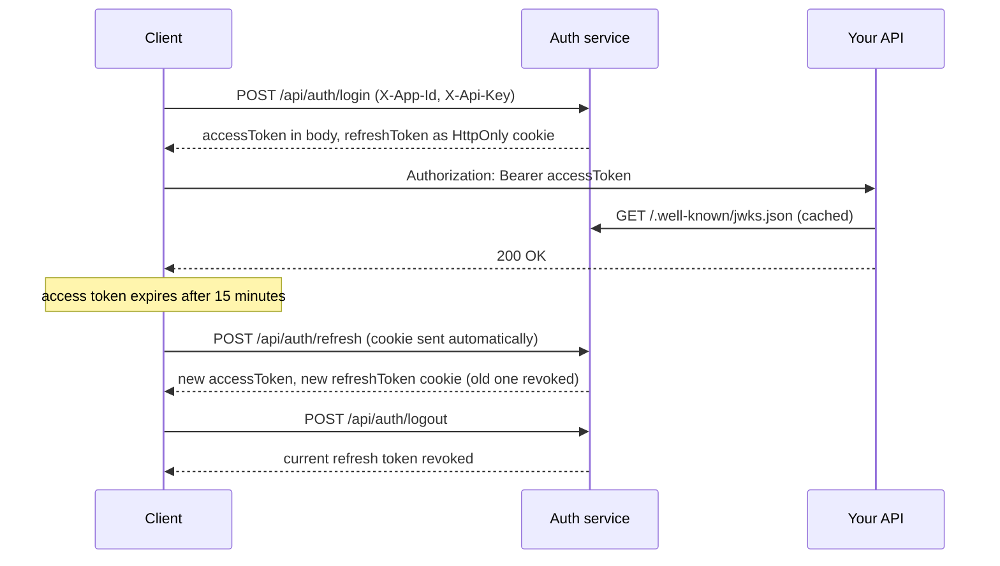

# dotnet-auth

A multi-tenant authentication service built with ASP.NET Core 9, ASP.NET Core Identity, and PostgreSQL.

Client applications register with the service and get an **App ID** and **API key**. Their users then register and log in through it. Access tokens are JWTs signed with an RSA private key (RS256). The matching public key is published as a JWKS, so any other service can verify tokens without sharing a secret.

## Features

- **Application clients (tenants).** Each app gets an App ID and an API key. Only an HMAC-SHA256 hash of the key is stored, and the raw key is shown once.
- **Per-app user accounts.** Every user belongs to one application client. Login checks both the user's credentials and the app's credentials.
- **RS256-signed JWTs with a JWKS endpoint.** The public key is served at `/.well-known/jwks.json`.
- **Short-lived access tokens, rotating refresh tokens.** Access tokens last 15 minutes. Refresh tokens last 7 days, are delivered only as an `HttpOnly`, `Secure`, `SameSite=Strict` cookie, and are replaced on every refresh.
- **Multiple sessions per user.** Each login gets its own refresh token, tagged with the device (User-Agent) and IP. Users can list their active sessions, and logout revokes only the current one.
- **Welcome email** on registration, sent over SMTP with MailKit.
- **Consistent JSON errors** from a global exception middleware.
- Swagger UI, a Dockerfile, and a Kubernetes manifest.

## Tech stack

| Area | Technology |
| --- | --- |
| Runtime | .NET 9, ASP.NET Core Web API |
| Users and passwords | ASP.NET Core Identity |
| Data | EF Core 9 with Npgsql (PostgreSQL) |
| Tokens | `System.IdentityModel.Tokens.Jwt`, RSA 2048 / RS256 |
| Email | MailKit |
| API docs | Swashbuckle (Swagger UI) |
| Tests | xUnit, Moq, MockQueryable |

## How it works

### Application clients

`POST /api/application-client` creates an app and returns its `id` and a random 32-byte `rawApiKey`. The service stores only `HMAC-SHA256(rawApiKey, Security:ApiKeySalt)`, so a lost key can't be recovered and you have to create a new app.

Register, login, and logout requests must include:

```
X-App-Id: <id>
X-Api-Key: <rawApiKey>
```

### Token signing and JWKS

At startup the service looks for `private_key.pem` in its output directory (next to `auth.webapi.dll`). If the file doesn't exist, the service generates a 2048-bit RSA key and saves it there. Despite the `.pem` name, the file holds a DER-encoded PKCS#1 key. Access tokens are signed with this key using RS256 and carry the `kid` set in `JWT:KeyId`.

`GET /.well-known/jwks.json` returns the public half of the key:

```json
{ "keys": [{ "kty": "RSA", "use": "sig", "kid": "dev-key", "alg": "RS256", "n": "...", "e": "AQAB" }] }
```

A downstream API can fetch this key set and validate a token's signature, issuer (`JWT:Issuer`), audience (`JWT:Audience`), and lifetime. It never needs the private key.

> Tokens are **signed, not encrypted**. Anyone holding a token can read its claims (user ID, email, username, `jti`), so keep sensitive data out of them.

### Token lifecycle



- **Access token:** a JWT with a 15-minute lifetime and zero clock skew. It comes back in the response body, and the client sends it as `Authorization: Bearer <token>`. Keep it in memory.
- **Refresh token:** 64 random bytes with a 7-day lifetime. It's saved in the `RefreshTokens` table with the user, app, User-Agent, and IP. The client receives it only as the `refreshToken` cookie, never in a response body.
- **Refresh:** `POST /api/auth/refresh` reads the cookie, revokes that token, and issues a new access token and refresh token. An expired, revoked, or missing token returns 401. This call doesn't need the app headers or the old access token.
- **Logout:** sets `IsRevoked = true` on the current refresh token; the row stays in the table. The user's other sessions keep working.
- **Sessions:** `GET /api/auth/sessions` lists the caller's unexpired, unrevoked refresh tokens.

### Registration

1. Validate the app credentials.
2. Reject the email with 409 if it's already registered for this app.
3. Create the Identity user, with the lowercased email as the username, and add it to the `User` role. The initial migration seeds the `Admin` and `User` roles.
4. Issue tokens the same way login does.
5. Send a welcome email. If sending fails, the error is logged and registration still succeeds.

Passwords need at least 6 characters, including a digit, an uppercase letter, a lowercase letter, and a symbol. The last three rules are Identity's defaults.

### Errors

Services throw subclasses of `AppException` ([auth.webapi/Helpers/AppException .cs](auth.webapi/Helpers/AppException%20.cs)). `GlobalExceptionMiddleware` turns them into JSON, taking the status code from `ExceptionStatusCodeMapper`:

| Exception | Status |
| --- | --- |
| `InvalidCredentialsException`, `RefreshTokenExpiredException`, `InvalidTokenException`, `AppUnauthorizedException` | 401 |
| `UserNotFoundException` | 404 |
| `EmailAlreadyExistsException` | 409 |
| `UserCreationFailedException` and any unmapped `AppException` | 400 |
| Any other exception | 500 |

The body is `{ "message": "..." }`. Debug builds add a `detail` field with the stack trace, or with the exception message for 500s.

## API

| Method | Route | Requires | Description |
| --- | --- | --- | --- |
| POST | `/api/application-client` | Nothing | Creates an app and returns `{ id, rawApiKey }` |
| POST | `/api/auth/register` | App headers | Body: `{ fullName, email, city, password }` |
| POST | `/api/auth/login` | App headers | Body: `{ email, password }` |
| POST | `/api/auth/refresh` | `refreshToken` cookie | Returns `{ accessToken }` and rotates the cookie |
| POST | `/api/auth/logout` | Bearer token, app headers, cookie | Revokes the current refresh token |
| GET | `/api/auth/sessions` | Bearer token | Lists active sessions |
| GET | `/.well-known/jwks.json` | Nothing | Public signing key |
| GET | `/api/auth/test` | Nothing | Returns `{ "message": "Test successful" }` |

Register and login return `{ id, fullName, userName, email, city, accessToken }` and set the refresh cookie. More request and response examples are in [auth.webapi/Docs/API.md](auth.webapi/Docs/API.md).

## Getting started

### Prerequisites

- .NET 9 SDK
- A PostgreSQL database
- An SMTP account for welcome emails (Gmail with an app password works)
- The EF Core CLI: `dotnet tool install --global dotnet-ef`

### Configuration

Every key below is required. If one is missing, the first request that needs it fails with a 500.

```json
{
  "ConnectionStrings": {
    "DefaultConnection": "Host=localhost;Database=auth;Username=postgres;Password=<password>"
  },
  "JWT": {
    "Issuer": "http://localhost:5183",
    "Audience": "http://localhost:5183",
    "KeyId": "dev-key"
  },
  "EmailSettings": {
    "From": "you@example.com",
    "SmtpServer": "smtp.gmail.com",
    "Port": "587",
    "Username": "you@example.com",
    "Password": "<SMTP or app password>"
  },
  "Security": {
    "ApiKeySalt": "<random base64 string, for example from: openssl rand -base64 32>"
  }
}
```

Keep real secrets out of `appsettings.json`. Use [user secrets](https://learn.microsoft.com/aspnet/core/security/app-secrets) locally and environment variables in containers, with `__` as the separator (for example `ConnectionStrings__DefaultConnection` or `Security__ApiKeySalt`).

Changing `Security:ApiKeySalt` invalidates every existing API key, because the stored hashes depend on it.

CORS allows only `http://localhost:3000`, with credentials. To allow a different front-end, change `ConfigureCors` in [auth.webapi/Extentions/ServiceExtentions.cs](auth.webapi/Extentions/ServiceExtentions.cs).

### Run locally

```bash
git clone https://github.com/Tharindu-s/dotnet-auth.git
cd dotnet-auth/auth.webapi
dotnet restore
dotnet ef database update      # applies the migrations to the configured database
dotnet run --launch-profile http
```

The API listens on `http://localhost:5183`, or on `https://localhost:7023` with the `https` profile. Swagger UI is at `/swagger`, but it has no fields for `X-App-Id` and `X-Api-Key`, so test the app-scoped endpoints with Postman, curl, or a similar client.

### Try it with curl

```bash
# 1. Create an app. Save the id and rawApiKey from the response.
curl -X POST http://localhost:5183/api/application-client \
  -H "Content-Type: application/json" -d '{"name":"My App"}'

# 2. Register a user. The refresh cookie is saved to cookies.txt.
curl -X POST http://localhost:5183/api/auth/register -c cookies.txt \
  -H "Content-Type: application/json" -H "X-App-Id: <id>" -H "X-Api-Key: <rawApiKey>" \
  -d '{"fullName":"Jane Doe","email":"jane@example.com","city":"Colombo","password":"Passw0rd!"}'

# 3. Exchange the refresh cookie for a new access token.
curl -X POST http://localhost:5183/api/auth/refresh -b cookies.txt -c cookies.txt

# 4. List sessions.
curl http://localhost:5183/api/auth/sessions -H "Authorization: Bearer <accessToken>"
```

The refresh cookie is marked `Secure`. If your client won't store it over plain HTTP, use the `https` profile.

## Docker and Kubernetes

```bash
# Run from the repository root
docker build -t dotnet-auth .
docker run -p 8080:8080 -e ConnectionStrings__DefaultConnection="<connection string>" dotnet-auth
```

The container listens on port 8080, the default for .NET 8 and later ASP.NET images. The `EXPOSE 80` line in the Dockerfile is out of date. `appsettings.json` is copied into the image, so keep secrets out of that file and pass them in as environment variables.

[deployment-service.yml](deployment-service.yml) runs two replicas of `tharindu007/dotnet-auth:latest` in the `dotnet-authentication` namespace and exposes them through a `LoadBalancer` service on port 8080. The namespace must exist before you apply the manifest:

```bash
kubectl create namespace dotnet-authentication
kubectl apply -f deployment-service.yml
```

Two caveats apply to this setup:

- Each pod generates its own signing key (see [Known limitations](#known-limitations)).
- Browsers only accept the `Secure` refresh cookie over HTTPS, so terminate TLS in front of the service.

## Tests

`auth.unitTest` is an xUnit project that references the API. The `AuthService` tests in [auth.unitTest/Auth/AuthServiceTests.cs](auth.unitTest/Auth/AuthServiceTests.cs) are commented out, so `dotnet test` currently runs only an empty placeholder test.

## Project structure

```
dotnet-auth/
├── auth.webapi/              # The auth service
│   ├── Controllers/          # AccountController, ApplicationClientController, JwskController (JWKS)
│   ├── Data/                 # ApplicationDbContext (Identity tables + seeded roles)
│   ├── DTO/                  # Request and response models
│   ├── Docs/API.md           # Endpoint reference with curl examples
│   ├── Extentions/           # Database, Identity, JWT bearer, CORS and Swagger setup
│   ├── Helpers/              # AppException types and the exception-to-status map
│   ├── Interfaces/           # Service contracts
│   ├── Middleware/           # GlobalExceptionMiddleware
│   ├── Migrations/           # EF Core migrations (PostgreSQL)
│   ├── Models/               # AppUser, ApplicationClient, RefreshToken
│   ├── Services/             # AuthService, TokenService, ApplicationClientService, EmailService, ConfigurationHelper
│   └── Program.cs            # Service registration and middleware pipeline
├── auth.unitTest/            # xUnit test project
├── Dockerfile                # Multi-stage build of auth.webapi
├── deployment-service.yml    # Kubernetes Deployment and LoadBalancer Service
└── dotnet-auth.sln
```

### Data model

- **ApplicationClient:** `Id` (the App ID), `Name`, `ApiKeyHash`, `CreatedAt`.
- **AppUser:** extends `IdentityUser` with `FullName`, `City`, and `ApplicationClientId`.
- **RefreshToken:** `Token`, `Expires`, `IsRevoked`, `Device`, `IPAddress`, `UserId`, `ApplicationClientId`.

## Known limitations

- **The signing key isn't shared or persisted.** Each instance generates its own key in its output directory on first start. A container restart therefore invalidates every token already issued, and with two Kubernetes replicas, a token from one pod fails validation on the other. Load the key from a mounted secret or a key vault instead.
- **The same email can't be used in two apps.** Usernames are the lowercased email, and Identity's username index is unique across the whole database. Registering an existing email under a second app fails with 400.
- **Mixed-case emails can't log in.** Registration stores the email as typed, but login compares it with the lowercased input, and PostgreSQL string comparison is case-sensitive.
- **Raw API keys are written to the logs.** `AccountController` logs the `X-Api-Key` header at Information level on every register, login, and logout.
- **Refresh tokens are stored in plaintext.** Hashing them the way API keys are hashed would protect sessions if the database leaked.
- **Anyone can create an application client.** `POST /api/application-client` has no authentication.
- **Logout doesn't verify the API key.** It requires the app headers but only uses the App ID.
- **Roles aren't included in the JWT.** Users are added to the `User` role, but no role claim is issued, so `[Authorize(Roles = "...")]` won't work.
- **Bad app credentials return 400 instead of 401.** `ApplicationClientAuthenticationException` is missing from `ExceptionStatusCodeMapper`.
- **Login has no rate limiting or lockout.** Password checks use `lockoutOnFailure: false`.
- **The EF model snapshot is gitignored.** [auth.webapi/.gitignore](auth.webapi/.gitignore) excludes `Migrations/*Snapshot.cs`, so `dotnet ef migrations add` has no current model to compare against.
- **`issuedAt` in session responses is always `0001-01-01`.** The field is never set.
- **Leftover debug code.** An inline middleware in `Program.cs` prints the token expiry on every request, `TokenService` prints each new token's expiry, `JWT:SigningKey` is unused (it's left over from HMAC signing), and `auth.webapi.http` still calls the template's `/weatherforecast` endpoint.

## License

MIT
